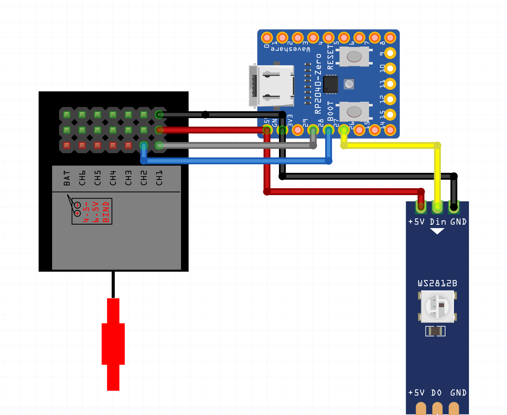

# pwm-ws2812
WS2812 LED strip color and brightness control with two RC PWM channels 

Brightness goes from 0 (off) to 255 (full power).  
Hue goes from Green, via Red to Blue.

## Wiring
- Microcontroller gets 5V power from RC receiver (red and black wires);
- RC channel 1 controls total brightness (gray wire);
- RC channel 2 controls hue / color mix (blue wire);
- WS2812 LED strip's signal wire connected to the microcontroller (yellow wire);
- WS2812 LED strip's 5V and GND shall be same as of microcontroller's, not necessarily connected as on the picture though.

Given wiring diagram is for Waveshare RP2040 Zero, other boards are also supported.  
Find pin numbers in respective `src/pins_*.go` files.

## Flashing

Waveshare RP2040 Zero:  
- Press and hold BOOT button;
- Plug in your board to your computer, release the button;
- RPI-RP2 mass storage device shall appear;
- Copy-paste `pwm-ws2812_xxx.uf2` file to this drive;
- Board reboots with new firmware installed, enjoy!
